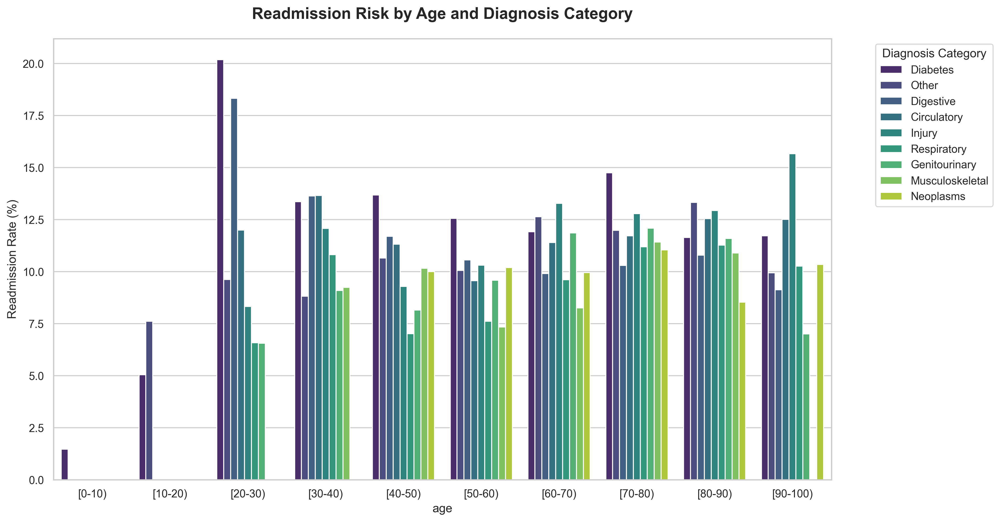
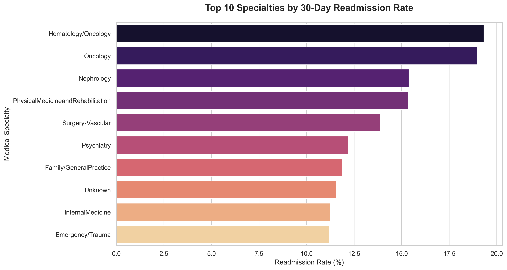
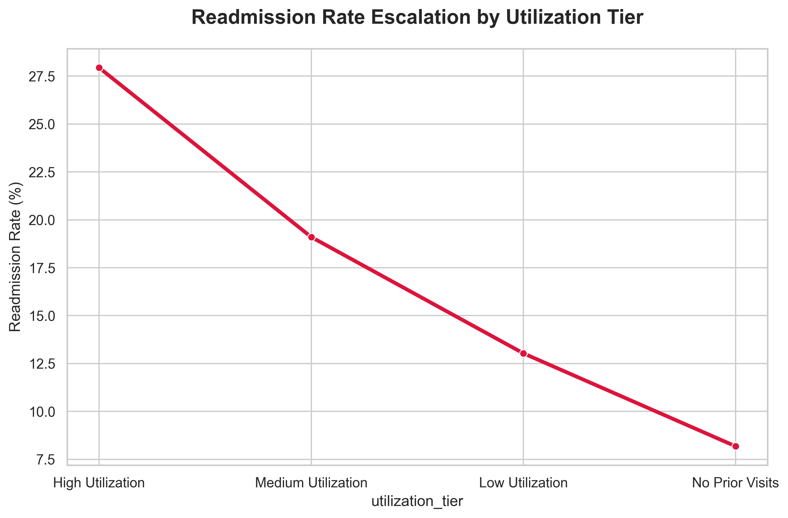
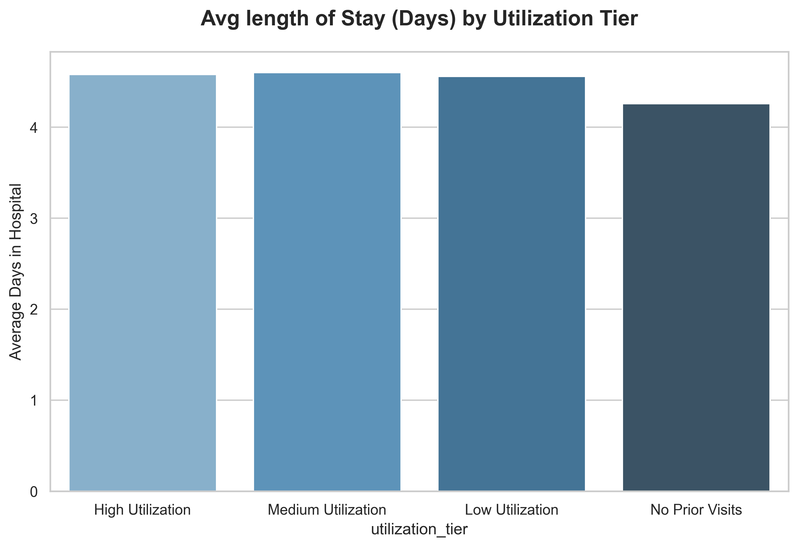
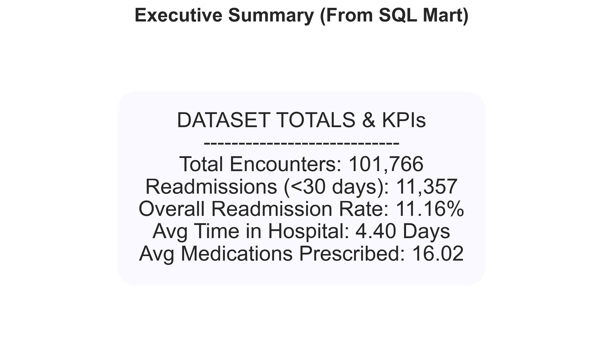

# Predicting 30-Day Hospital Readmissions for Diabetes Patients

## Executive Summary

Hospital readmissions within 30 days cost the US healthcare system **~$41 billion annually**. Under the Hospital Readmissions Reduction Program (HRRP), hospitals face CMS penalties for excess readmissions.

This project analyzes **101,766 patient encounters** across **130 US hospitals** (1999–2008) to identify key readmission drivers and build a predictive model that flags high-risk diabetes patients at discharge.

> **Bottom line:** A predictive model targeting 500 high-risk patients per hospital could prevent ~100 readmissions annually, saving an estimated **$1.5M per hospital per year**.

---

## Interactive Dashboard

📊 **[View the Live Tableau Dashboard →](https://public.tableau.com/app/profile/niraj.mehta5678/viz/HospitalReadmissionRiskDashboard/dashboard_overview)**

An interactive Tableau dashboard is available for exploring readmission patterns across diagnosis categories, age groups, medical specialties, and discharge destinations.

### Dashboard Overview
The overview page presents hospital-wide KPIs (total patients, readmission rate, avg medications, avg length of stay) and breaks down readmission rates by diagnosis, age group, medical specialty, and discharge destination.


### Deep Dive Analysis
The deep dive page shows a risk matrix (total visits prior vs. num medications), high utilizer impact, length of stay distribution, A1C testing impact, and medication change impact on readmission rates.


---

## Key Findings

| #   | Finding                                         | Detail                                                                     |
| --- | ----------------------------------------------- | -------------------------------------------------------------------------- |
| 1   | **Prior inpatient visits** are the #1 predictor | Patients with 3+ prior visits have 25%+ readmission rate (vs. 9% baseline) |
| 2   | **HbA1c not tested** in 83% of encounters       | Mandating testing is a low-cost, high-impact intervention                  |
| 3   | **Medication complexity** matters               | Patients on 15+ medications have significantly higher risk                 |
| 4   | **Length of stay** signals severity             | Longer stays correlate with higher readmission probability                 |
| 5   | **Discharge destination** is critical           | Where patients go after discharge affects readmission risk                 |

---


---

## SQL ETL & Analytics Pipeline

This project includes a production-grade **SQL ETL (Extract, Transform, Load)** pipeline built in SQLite. It transforms raw healthcare data into a structured star schema optimized for BI and advanced analytics.

### 1. Data Architecture
The pipeline follows a tiered data architecture:
- **Staging (`stg_encounters`)**: Standardizes missing values (`?` → `NULL`) and derives initial boolean flags.
- **Dimensions**: Built using robust "fill-down" logic to handle the hierarchical structure of `IDs_mapping`.
  - `dim_admission_type`, `dim_discharge_disposition`, `dim_admission_source`, `dim_medical_specialty`
- **Facts**: 
  - `fct_encounters`: Enriched encounter-level data with ICD-9 diagnosis categorizations.
  - `fct_patient_latest`: Snapshot of the most recent encounter per patient for longitudinal analysis.
- **Marts (Views)**: Consumption-ready views for performance.
  - `mart_readmission_kpis`, `mart_readmission_by_age_diag`, `mart_high_utilizers`

### 2. SQL-to-Python Visualization Suite
A bridge script (`src/sql_charts.py`) leverages the power of SQL for heavy aggregation and Python (Seaborn/Matplotlib) for high-fidelity visualization.

#### SQL Automated Insights
The following charts are generated directly from the SQL Mart views:

| Insight | Visualization |
| :--- | :--- |
| **Readmission by Age & Diagnosis** |  |
| **Top 10 Specialties by Risk** |  |
| **Utilization Tier Impact** |  |
| **Length of Stay Trends** |  |
| **Executive Summary (SQL)** |  |

---

---

## Model Performance

### Model Comparison

| Model               | AUC-ROC | Notes                                        |
| ------------------- | ------- | -------------------------------------------- |
| Logistic Regression | 0.69    | Interpretable baseline (scaled features)     |
| Random Forest       | 0.68    | Handles non-linearity, class_weight balanced |
| Gradient Boosting   | 0.68    | Balanced class weights, comparable to RF     |

> **Note:** AUC-ROC of 0.68–0.69 is consistent with published benchmarks for this dataset (Strack et al., 2014). The model is used for risk stratification, not individual prediction; healthcare readmission is inherently challenging due to missing social determinants of health.

### ROC Curve Comparison
All three models perform similarly, with Logistic Regression achieving the highest AUC-ROC of 0.69. The tight clustering of curves confirms that model choice matters less than feature engineering for this dataset.


### Confusion Matrices
Confusion matrices for all three models show balanced predictions after fixing the class imbalance handling. All models now properly predict both classes, with AUC values of 0.688 (LR), 0.681 (RF), and 0.683 (GB).


### Feature Importance — Gradient Boosting
The top predictors from the Gradient Boosting model: number of prior inpatient visits, time in hospital, number of medications, and number of lab procedures.


---

## Business Recommendations

| #   | Action                                                                       | Expected Impact               |
| --- | ---------------------------------------------------------------------------- | ----------------------------- |
| 1   | Flag patients with 1+ prior inpatient visits for enhanced discharge planning | Targets highest-risk group    |
| 2   | Mandate HbA1c testing for all diabetic admissions                            | Standard of care improvement  |
| 3   | 7-day post-discharge follow-up calls for flagged patients                    | Catch complications early     |
| 4   | Deploy real-time risk score at discharge                                     | Proactive resource allocation |
| 5   | Complex medication review at discharge for patients on 15+ medications       | Reduce polypharmacy risk      |

### Projected Cost Savings
Conservative estimates show that flagging 500 high-risk patients per hospital and achieving a 20% prevention rate could save **$1.5M per hospital per year**.


---

## Project Structure

```
diabetes-readmission-analytics/
│
├── README.md
├── requirements.txt
├── .gitignore
│
├── data/
│   └── raw/                    # Original untouched dataset (not tracked in Git)
│       ├── diabetic_data.csv
│       └── IDs_mapping.csv
│
├── notebooks/
│   ├── 01_data_profiling.ipynb       # Initial exploration and quality assessment
│   ├── 02_data_cleaning.ipynb        # Cleaning, deduplication, missing values
│   ├── 03_feature_engineering.ipynb  # New features, encoding, transformations
│   ├── 04_eda.ipynb                  # Exploratory analysis and visualizations
│   ├── 05_modeling.ipynb             # Model training, tuning, evaluation
│   └── 06_insights_recommendations.ipynb  # Business insights and impact analysis
│
├── sql/
│   ├── 01_create_tables.sql          # Load CSV into SQL database
│   ├── 02_data_profiling.sql         # Profiling queries
│   ├── 03_validation_queries.sql     # Post-cleaning validation checks
│   ├── data_profiling.sql            # Extended profiling queries
│   └── feature_queries.sql           # Feature-level SQL analysis
│
├── src/
│   ├── __init__.py
│   ├── data_cleaning.py              # Data preprocessing pipeline
│   ├── feature_engineering.py        # Feature creation and encoding
│   ├── modeling.py                   # Model training and evaluation
│   ├── run_data_pipeline.py          # End-to-end pipeline runner
│   └── visualizations.py             # Chart generation utilities
│
├── model/                             # Saved trained model artifacts
│   ├── best_model.pkl
│   └── scaler.pkl
│
├── tests/
│   └── test_cleaning.py              # Unit tests for data cleaning functions
│
└── images/
    ├── eda_charts/                    # EDA and modeling visualizations
    └── tableau/                       # Tableau dashboard screenshots
        ├── dashboard_overview.png
        └── dashboard_deep_dive.png
```

---

## Tools & Technologies

| Category             | Tools                                                                |
| -------------------- | -------------------------------------------------------------------- |
| **Languages**        | Python, SQL                                                          |
| **Data Analysis**    | Pandas, NumPy, SciPy                                                 |
| **Machine Learning** | Scikit-learn (Logistic Regression, Random Forest, Gradient Boosting)  |
| **Visualization**    | Matplotlib, Seaborn, Tableau                                         |
| **Database**         | SQLite (optional, for SQL profiling)                                 |
| **Dashboard**        | [Tableau Public](https://public.tableau.com/app/profile/niraj.mehta5678/viz/HospitalReadmissionRiskDashboard/dashboard_overview) |
| **Environment**      | Jupyter Lab                                                          |

---

## How to Run This Project

If you want to reproduce the analysis or run the dashboard locally, follow these steps:

### 1. Clone the Repository

```bash
git clone https://github.com/nirajmehta960/diabetes-readmission-analytics.git
cd diabetes-readmission-analytics
```

### 2. Set Up a Virtual Environment 

```bash
python3 -m venv venv
source venv/bin/activate  # On macOS/Linux
```

### 3. Run the SQL ETL & Visualization Suite

**Step A: Initialize the Database**
```bash
# Create DB and import raw CSVs
sqlite3 data/diabetes.sqlite <<EOF
.mode csv
.import data/raw/diabetic_data.csv diabetic_data
.import data/raw/IDS_mapping.csv IDs_mapping
.quit
EOF
```

**Step B: Run the ETL Pipeline**
Run the verified ETL scripts in sequence:
```bash
sqlite3 data/diabetes.sqlite < sql/etl/00_init.sql
sqlite3 data/diabetes.sqlite < sql/etl/10_staging.sql
sqlite3 data/diabetes.sqlite < sql/etl/20_dimensions.sql
sqlite3 data/diabetes.sqlite < sql/etl/30_facts.sql
sqlite3 data/diabetes.sqlite < sql/etl/40_marts.sql
```

**Step C: Generate Python Charts from SQL Marts**
```bash
python3 src/sql_charts.py
```

### 4. Install Dependencies for ML Pipeline

```bash
pip install -r requirements.txt
```

### 4. Download the Data

1. Download the dataset from the [UCI Machine Learning Repository](https://archive.ics.uci.edu/dataset/296/diabetes+130-us-hospitals+for+years+1999-2008).
2. Unzip the file `diabetes+130-us-hospitals+for+years+1999-2008.zip`.
3. Place `diabetic_data.csv` and `IDs_mapping.csv` into the `data/raw/` directory.

### 5. Run the Analysis

**Option A: Run via Jupyter Notebooks (Recommended)**
Launch Jupyter Lab and run the notebooks in order. The pipeline is: raw data (Phase 1) to preprocessed (Phase 2) to featured/model-ready (Phase 3), then EDA, modeling, and insights.

```bash
jupyter lab
```

Run in order:

1. `notebooks/01_data_profiling.ipynb` — initial exploration and SQL profiling
2. `notebooks/02_data_cleaning.ipynb` — cleaning, deduplication; outputs `data/preprocessed/diabetic_preprocessed.csv`
3. `notebooks/03_feature_engineering.ipynb` — new features and encoding; outputs `data/featured/diabetic_featured.csv` and `data/featured/model_ready.csv`
4. `notebooks/04_eda.ipynb` — exploratory analysis and visualizations (uses preprocessed or featured data)
5. `notebooks/05_modeling.ipynb` — train/evaluate models; saves ROC and confusion matrix to `images/`; save trained models (e.g. via `joblib.dump`) to `model/`
6. `notebooks/06_insights_recommendations.ipynb` — hypothesis validation, risk tiers, financial impact, recommendation cards

**Option B: Run via Python scripts**
From the project root, run preprocessing and/or feature engineering with default paths (`data/raw/`, `data/preprocessed/`, `data/featured/`):

Run the full data pipeline (Phase 2 + Phase 3):

```bash
python src/run_data_pipeline.py
```

Run preprocessing only (Phase 2; writes `data/preprocessed/diabetic_preprocessed.csv`):

```bash
python src/data_cleaning.py
```

Run feature engineering only (Phase 3; reads preprocessed, writes `data/featured/diabetic_featured.csv` and `data/featured/model_ready.csv`):

```bash
python src/feature_engineering.py
```

### 6. Run Tests

```bash
python -m pytest tests/ -v
```

### 7. Dashboard and Reports

- **Dashboard:** Explore the interactive Tableau dashboard at **[Tableau Public](https://public.tableau.com/app/profile/niraj.mehta5678/viz/HospitalReadmissionRiskDashboard/dashboard_overview)**.
- **Reports:** Place `project_report.pdf`, `executive_summary.pdf`, and `presentation.pptx` in the `reports/` folder.
- **Images:** Model outputs (ROC curve, confusion matrix, feature importance) and EDA charts are saved under `images/` and `images/eda_charts/`.

---

## Data Source

**UCI Machine Learning Repository — Diabetes 130-US Hospitals (1999–2008)**

- 101,766 encounters | 50 features | 130 US hospitals
- [Dataset Link](https://archive.ics.uci.edu/dataset/296/diabetes+130-us-hospitals+for+years+1999-2008)
- License: CC BY 4.0
- Original paper: Strack, B. et al. (2014). "Impact of HbA1c measurement on hospital readmission rates"

---

## Estimated Cost Impact

```
Average cost per readmission:           $15,000
High-risk patients flagged per year:        500
Readmissions prevented (20% rate):          100
───────────────────────────────────────────────
Annual savings per hospital:         $1,500,000
```
